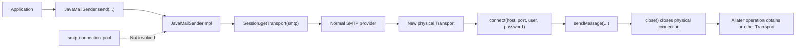
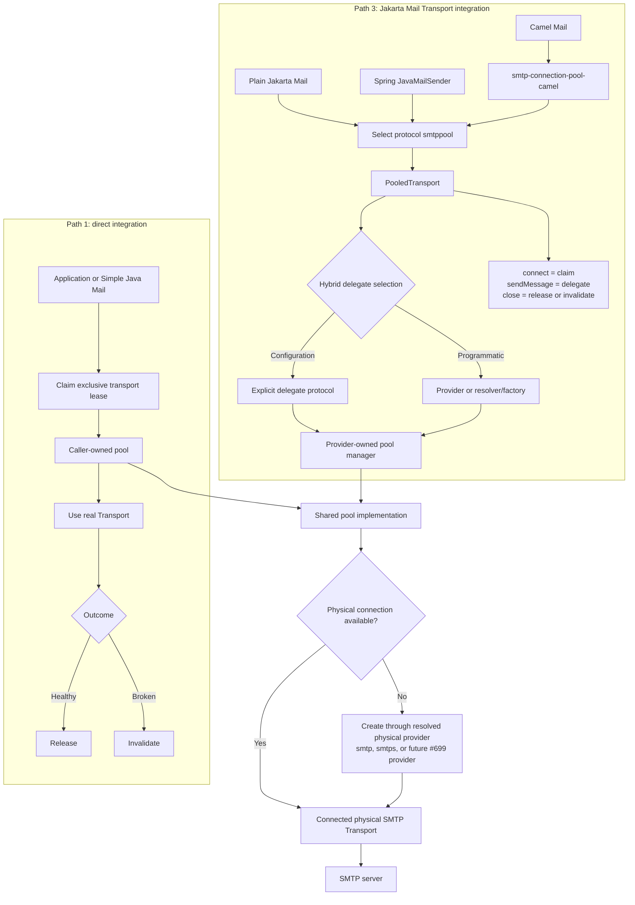
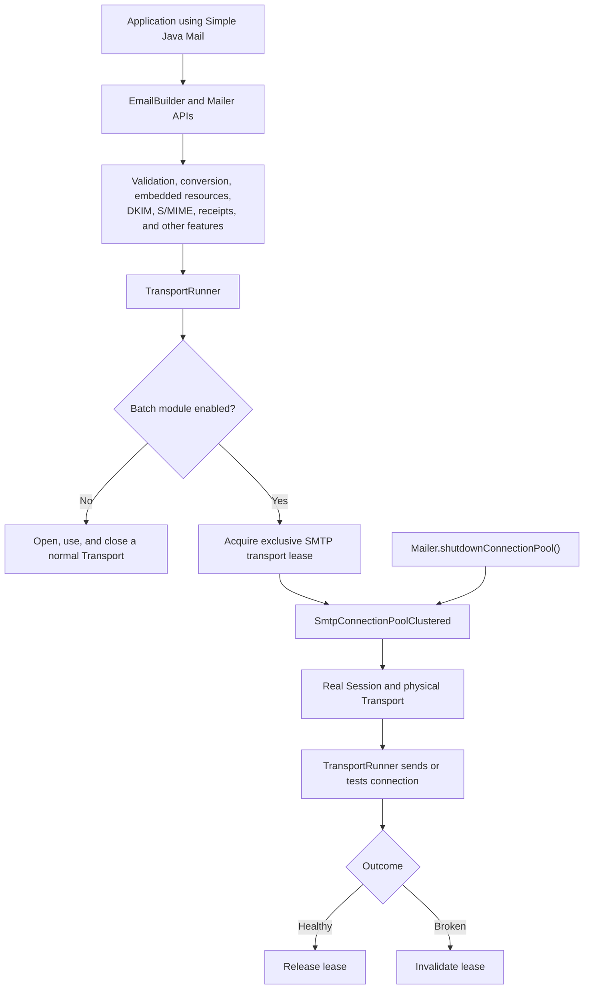
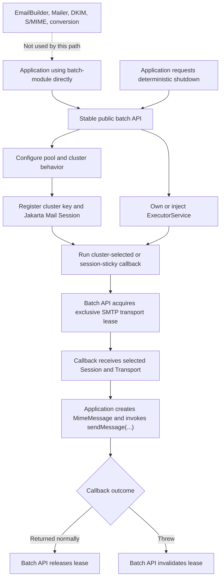

# Product vision: three ways to use pooled SMTP transports

- Status: **shipped in `4.0.0` through [#10](https://github.com/simple-java-mail/smtp-connection-pool/issues/10)**
- Release: **`4.0.0`**
- Simple Java Mail standalone batch follow-up: **shipped in `9.3.0` through [#698](https://github.com/bbottema/simple-java-mail/issues/698)**
- Related transport initiative: **[Simple Java Mail #699](https://github.com/bbottema/simple-java-mail/issues/699)**

## See it work

Start with the [demo project](smtp-connection-pool-demo/README.md), not the diagrams. It turns the product model into six runnable integrations against a random-port dummy SMTP server:

1. [direct pool ownership](smtp-connection-pool-demo/src/main/java/org/simplejavamail/smtpconnectionpool/demo/DirectPoolDemo.java), including forced disconnect, invalidation, and recovery;
2. [Simple Java Mail](smtp-connection-pool-demo/src/main/java/org/simplejavamail/smtpconnectionpool/demo/SimpleJavaMailDemo.java) as a higher-level library built directly on the pool;
3. [standalone batch-module](smtp-connection-pool-demo/src/main/java/org/simplejavamail/smtpconnectionpool/demo/BatchModuleDemo.java) orchestration over caller-created Jakarta Mail messages; and
4. [plain Jakarta Mail](smtp-connection-pool-demo/src/main/java/org/simplejavamail/smtpconnectionpool/demo/JakartaMailDemo.java), [Spring](smtp-connection-pool-demo/src/main/java/org/simplejavamail/smtpconnectionpool/demo/SpringDemo.java), and [Camel](smtp-connection-pool-demo/src/main/java/org/simplejavamail/smtpconnectionpool/demo/CamelDemo.java) as path-3 variants.

The smoke tests assert delivered messages, the number of physical connections opened, connection reuse, and zero active connections after shutdown. The demo is built and tested with the rest of the project but excluded from Maven Central, so Maven Central contains only the three modules listed below.

The standalone path-2 demo uses the public API released by Simple Java Mail 9.3.0 through #698. It never calls an internal batch type and remains distinct from the higher-level `SimpleJavaMailDemo`.

## Product promise

`smtp-connection-pool` supports two kinds of integration:

- software that deliberately owns the claim, send, release/invalidate, and shutdown lifecycle; and
- software that only knows the standard Jakarta Mail `Session` and `Transport` lifecycle.

The new Jakarta Mail provider is an adapter around the existing pool. It does not replace the direct API, turn this project into an email-building library, or make every integration share one global pool.

The pool owns connection leasing and lifecycle; the selected Jakarta Mail `Transport` owns the SMTP conversation on that connection. SMTP extensions such as PIPELINING and CHUNKING, capability negotiation, and provider-specific response parsing remain transport-implementation concerns.

## The three usage paths

These are product choices, not a one-to-one count of Maven artifacts.

| Path | Choose this when | Who manages the pool | Status |
| --- | --- | --- | --- |
| 1. Use `smtp-connection-pool` directly | The application or a higher-level library needs full control over clustering, selection, transport access, failure handling, and shutdown. Simple Java Mail itself uses this path. | The application or library | Available now |
| 2. Use Simple Java Mail's `batch-module` directly | The application wants the batch executor and clustered pooling without the higher-level `EmailBuilder` and `Mailer` APIs. It still creates its own `MimeMessage` objects and sends them inside a safe transport callback. | Simple Java Mail's public batch API | Available since Simple Java Mail 9.3.0 through [#698](https://github.com/bbottema/simple-java-mail/issues/698) |
| 3. Use it as a Jakarta Mail `Transport` | A framework owns `Transport` acquisition and closing. Plain Jakarta Mail and Spring select the `smtppool` protocol; Camel uses a small adapter that makes the same selection. | `PooledTransport` | Available since 4.0.0 through [#10](https://github.com/simple-java-mail/smtp-connection-pool/issues/10) |

Simple Java Mail remains on path 1 internally. It should reuse the common lease contract introduced by this work, but should not route its richer transport lifecycle through `PooledTransport`. Its public path-2 API keeps the raw lease internal and automatically releases or invalidates it around the caller's callback.

## Physical transport boundary and Simple Java Mail #699

[Simple Java Mail #699](https://github.com/bbottema/simple-java-mail/issues/699) explores a faster physical SMTP implementation with negotiated PIPELINING and CHUNKING. It is complementary to this plan rather than a fourth usage path or an implementation dependency.

If #699 produces a Jakarta Mail `Transport` provider, that provider can sit beneath any of the three paths:

```text
Simple Java Mail, batch-module, Spring, Camel, or plain Jakarta Mail
                              -> smtp-connection-pool lifecycle
                              -> selected physical Jakarta Transport
                              -> SMTP server
```

To work together safely, physical SMTP implementations must follow these rules:

- The allocator and `smtppool` provider accept an explicit delegate protocol or `Provider`; they are not hard-coded to Angus, `smtp`, or `smtps`.
- A pooled delegate `Transport` represents one reusable physical SMTP connection. The pool leases it exclusively and serially; it never assumes that one connection can be used concurrently even if a delegate implementation is thread-safe.
- There is exactly one owner of physical-connection pooling. A delegate used beneath `smtp-connection-pool` must not hide another connection pool. An adapter over an asynchronous client may own its event-loop/channel resources, but creates one reusable physical session per Jakarta `Transport` instance.
- The delegate implements Jakarta Mail's synchronous `Transport` contract. If it adapts an asynchronous client, that adapter owns the async-to-sync bridge and must not block its own event-loop thread.
- EHLO, STARTTLS re-negotiation, PIPELINING, CHUNKING, and other capabilities are negotiated and refreshed by the delegate whenever it connects or reconnects. The pool neither caches nor interprets those capabilities.
- Standard `MessagingException`/`SendFailedException` behavior and `TransportListener` events cross the boundary without concrete Angus types. Message delivery outcome and physical-connection health are separate decisions: a recipient rejection can leave a connection reusable, while an I/O failure invalidates it.
- If #699 instead uses Simple Java Mail's `CustomMailer`, that backend owns its own session/reuse lifecycle and remains outside this repository's pooling paths. It must not be stacked on `smtp-connection-pool` accidentally.

This repository does not wait for #699 and does not depend on NioSmtpClient or any other candidate implementation. It supplies and tests the neutral boundary so #699 can compose later without changing the three-path product model.

## Published modules

The project now builds several Maven modules at one shared version. Existing users keep the same `org.simplejavamail:smtp-connection-pool` dependency.

| Artifact | Responsibility | Dependencies |
| --- | --- | --- |
| `org.simplejavamail:smtp-connection-pool` | Existing direct API, physical connection pooling, and the exclusive transport-lease contract | Jakarta Mail API and clustered-object-pool |
| `org.simplejavamail:smtp-connection-pool-jakarta-provider` | `smtppool` Jakarta Mail provider, configuration mapping, provider-owned pool registry, and explicit shutdown API | The original pool module; the application supplies a compatible physical Jakarta Mail `Transport` provider at runtime |
| `org.simplejavamail:smtp-connection-pool-camel` | Camel-specific selection adapter; it must not globally replace Camel's normal `smtp` provider | Jakarta provider plus a declared/tested Camel line |

The `jakarta-provider` name is deliberate: Jakarta Mail owns the SPI contract; this artifact supplies an implementation of it. The Camel artifact is selection glue over that provider, not a second mail-provider SPI.

Simple Java Mail's existing `batch-module` remains in the Simple Java Mail repository. It is path 2, not a fourth module in this repository. The demo project described above is executable documentation and is not published to Maven Central.

The root POM is the shared Maven parent. The original library remains available as `org.simplejavamail:smtp-connection-pool`, so existing builds do not need a dependency change. Every module released from this repository uses the same version and tag. Although `4.0.0` deliberately marks a major architectural milestone, the original library remains binary-compatible with `3.1.0`.

## Shared lifecycle contract

Both the Jakarta provider and Simple Java Mail need the same small abstraction over a claimed pooled object. The original pool module exposes `SmtpTransportLease` with:

- the Jakarta Mail `Session` that created the physical transport;
- the real, connected `Transport`;
- an idempotent success operation that releases the transport for reuse;
- an idempotent failure operation that invalidates and removes the transport; and
- an observable terminal state so a transport cannot be returned twice.

The contract exposes explicit `release()` and `invalidate()` outcomes. `AutoCloseable.close()` is a convenience that releases only while the lease is still active, so exception paths that make health uncertain invalidate first. Existing `PoolableObject<SessionTransport>` APIs remain source-compatible; the lease is an additional, safer entry point.

## Jakarta provider contract

The provider artifact registers the custom transport protocol `smtppool` through Jakarta Mail's provider metadata and supported `ServiceLoader` mechanism. Classpath discovery is implemented and tested. The 4.0.1 JPMS follow-up gives the core pool, provider, and Camel adapter stable automatic module names and consumes fixed generic/clustered pool releases; the build compiles an end-to-end module-path consumer over the full five-module chain.

`PooledTransport` translates the standard lifecycle as follows:

| Standard call | Pool action |
| --- | --- |
| `connect(...)` / provider `protocolConnect(...)` | Resolve the hybrid delegate selection and connection identity, then claim and install one lease generation; clean it up immediately if connection fails |
| `sendMessage(...)` | Delegate to the leased physical transport and record whether it remains reusable |
| `isConnected()` | Reflect both wrapper state and the physical transport state |
| `close()` after healthy use | Release the lease |
| `close()` after a connection/protocol failure | Invalidate the lease |

The wrapper must preserve the host, port, username, password/authenticator outcome, and delegate selection supplied by Jakarta Mail or Spring. Pools are isolated by `Session` plus normalized delegate protocol and provider identity, host, effective/default port, username, and a private authentication identity or credential generation. Rotating from credential A to B must not borrow a connection authenticated as A: B becomes current immediately, while A drains only leases already in flight and is then removed. Switching between two providers for the same protocol must not cross-borrow. Raw passwords/tokens must not be used directly in equality, retained unnecessarily, logged, or exposed through `toString()`; retired credential material is cleared when that generation finishes draining.

If claiming or connecting fails, `protocolConnect` removes and invalidates any partially installed lease before returning `false` or propagating a `MessagingException`; callers are not required to call `close()` after failed `connect()`. A blocking claim interrupted by shutdown or thread interruption preserves the thread's interrupt flag and is surfaced as a `MessagingException` with its cause. If `isConnected()` discovers a dead delegate, a later `connect()` invalidates the stale generation before claiming another.

Failure classification is centralized and transport-neutral; it must not depend on Angus implementation classes. A disconnected or protocol-broken delegate is invalidated. A message-level rejection may be released only when the delegate is demonstrably still connected; an unknown failure is handled conservatively by invalidating it. Transport listeners registered on `PooledTransport` receive delivered, not-delivered, and partially-delivered events for that wrapper without listeners leaking to later borrowers of the physical transport.

Each successful `connect()` creates a new lease generation. `close()` atomically detaches and terminates that generation once, calls the Jakarta `Service.close()` behavior in a `finally` path, and cannot race a send into returning a still-used transport. Repeated `close()` is harmless for the same generation; a later `connect()` after close is supported and starts a fresh generation.

The provider owns pools by default and exposes deterministic per-`Session` and global shutdown. Graceful shutdown rejects new claims, lets active lease generations finish, and reports completion only after their physical transports close. Callers may time out while waiting and escalate through forced shutdown, which invalidates active leases and returns the same lifecycle `Future`. The Session keeps its shutting-down manager registered until that handle finishes, so escalation cannot accidentally target an empty replacement manager. Claim, manager installation, close, reconnect, and shutdown races have one observable outcome. Manager injection is available for applications that own lifecycle centrally. A shut-down Session remains closed to claims until cleanup finishes and an explicit registry restart occurs.

### How the physical SMTP provider is selected

The public protocol name is `smtppool`. The provider never registers itself as, or pretends to be, `smtp` or `smtps`.

The physical delegate is selected through two deliberate entry points that converge on the same allocator and connection identity:

| Entry point | Intended use | Result |
| --- | --- | --- |
| Declarative protocol selection | Plain Jakarta Mail, Spring, Camel, and ordinary configuration | A provider property names the real delegate protocol, normally `smtp` or `smtps` but not limited to them |
| Programmatic provider/resolver selection | Containers, tests, and custom transports such as a future #699 provider | An injected Jakarta Mail `Provider` or resolver/factory selects the real delegate without exposing its implementation through the lease API |

The declarative key is `mail.smtppool.delegate.protocol` and defaults to `smtp`. Programmatic integrations use `SmtpPoolProperties.setDelegateProvider(...)` or `setDelegateProviderResolver(...)`. Both branches resolve a concrete provider identity before the pool key is constructed, and both reject `PooledTransport` itself as the physical delegate. The complete property table is in the [provider reference](smtp-connection-pool-jakarta-provider/README.md).

Camel's adapter therefore performs an explicit selection, conceptually `getTransport("smtppool")`. That selection glue lives only in the separate `smtp-connection-pool-camel` module; pooling and physical-provider selection remain in the original pool and Jakarta-provider modules. It does not register the wrapper under Camel's expected `smtp` name. Ordinary `smtp` and `smtps` lookups continue to return their ordinary providers.

### Preventing recursive provider lookup

The provider must never create its physical connection with the no-argument/default `Session.getTransport()` when the Session's default transport protocol or address mapping resolves to `smtppool`: that would select `PooledTransport` again forever.

The provider path therefore requests the real delegate through the locked hybrid selection: an explicit protocol for normal configuration, or a supplied `Provider`/resolver for programmatic integration. It rejects the pooled provider itself even when it is reached through an alias or address mapping. The existing direct API keeps its current Session-selected behavior for compatibility. This is an explicit allocator/factory input, not a global replacement of the normal `smtp` provider.

## Framework contract

- **Plain Jakarta Mail:** request `session.getTransport("smtppool")` and use normal `connect`, `sendMessage`, and `close` calls.
- **Spring:** configure `JavaMailSenderImpl` to use protocol `smtppool`. Spring continues to supply host, port, username, and password through its normal connection call.
- **Camel:** use the optional `smtppool:` or `smtppools:` Camel component, which explicitly selects the Jakarta provider while retaining `smtp` or `smtps` as the physical delegate. Do not spoof or register `PooledTransport` globally as `smtp`, because that would change unrelated Jakarta Mail users and create delegate-recursion risk.

The Camel module targets Camel Mail 4.21 and Java 17. The original pool and Jakarta provider remain compatible with Java 8, so Camel cannot raise their baseline.

## Non-goals

- Creating messages, templates, recipient policy, retry queues, DKIM, S/MIME, or other higher-level mail features.
- Replacing Simple Java Mail's direct integration with the `smtppool` protocol.
- Making the three paths share a single pool instance automatically.
- Spoofing or hijacking the standard `smtp` or `smtps` provider for an entire classloader.
- Hiding shutdown. Provider-owned pools still require a documented lifecycle boundary.
- Exposing Simple Java Mail's internal `OperationalConfig` as the batch-module API.
- Implementing SMTP PIPELINING, CHUNKING, or a NioSmtpClient adapter in this repository.
- Interpreting Simple Java Mail receipts or depending on a concrete physical transport implementation.
- Nesting this pool around another owner of physical SMTP connection pooling.

## Architecture flows

### 1. Current direct pool usage

Today the caller must explicitly claim a transport and explicitly release or invalidate it.

```mermaid
flowchart LR
    APP["Application or integrating library"] --> CLAIM["claimTransport(...) or legacy claimResource..."]
    CLAIM --> AVAILABLE{"Reusable pooled object available?"}
    AVAILABLE -- "Yes" --> REUSE_CHECK["allocateForReuse checks Transport.isConnected()"]
    REUSE_CHECK --> CONNECTED{"Still connected?"}
    CONNECTED -- "Yes" --> BORROW["Borrow SessionTransport"]
    CONNECTED -- "No" --> RECONNECT["Reconnect the existing Transport"]
    RECONNECT -- "Succeeded" --> BORROW
    RECONNECT -- "Failed" --> REPLACE["Claim fails; connection is not handed to the caller"]
    AVAILABLE -- "No" --> ALLOCATOR["TransportAllocator"]
    ALLOCATOR --> DEFAULT_LOOKUP["Session.getTransport()"]
    DEFAULT_LOOKUP --> SMTP_PROVIDER["Configured real provider"]
    SMTP_PROVIDER --> CREATE["Create and connect physical Transport"]
    CREATE --> BORROW
    BORROW --> SEND["Caller invokes sendMessage(...)"]
    SEND --> RESULT{"Send outcome"}
    RESULT -- "Healthy" --> RELEASE["PoolableObject.release()"]
    RESULT -- "Broken or uncertain" --> INVALIDATE["PoolableObject.invalidate()"]
    RELEASE --> REUSE["Connection can be reused"]
    INVALIDATE --> REMOVE["Connection is closed and removed"]
```



### 2. Spring today

Spring owns the transport lifecycle, so the current direct pool API cannot be inserted around it.



Spring can reuse one transport within a single multi-message `send(...)` call, but it closes that transport when the call finishes.

### 3. Direct, Spring, and Camel paths together

The direct API and Jakarta provider share the connection-pool implementation while keeping their lifecycles separate. The Camel adapter reaches the same provider without globally replacing `smtp`.



### 4. Simple Java Mail remains a direct integration (follow-up work)

Simple Java Mail keeps the richer lifecycle that a generic provider would hide. Its adoption of the exclusive lease contract is tracked separately in issue #698.



### 5. Simple Java Mail batch module as the middle path

This public API supplies batching and pool-aware transport lifecycle without requiring the full Simple Java Mail mailer abstraction. The callback is the public safety boundary; the raw lease stays inside the module.



The batch API does not take responsibility for message construction, recipients, delivery retry policy, or the capabilities supplied by the higher-level Simple Java Mail APIs.

## Decision boundary

This is the product direction shipped in `4.0.0`. Public class names, Session properties, and the Camel 4.21/Java 17 matrix are recorded in the module references. Later refinements must preserve the three paths, their lifecycle responsibilities, hybrid physical-provider selection, explicit `smtppool` protocol, rejection of `smtp`/`smtps` spoofing, single-pooling-owner rule, and Simple Java Mail's direct use of the pool. GitHub issue #10 remains the record of the accepted scope.
